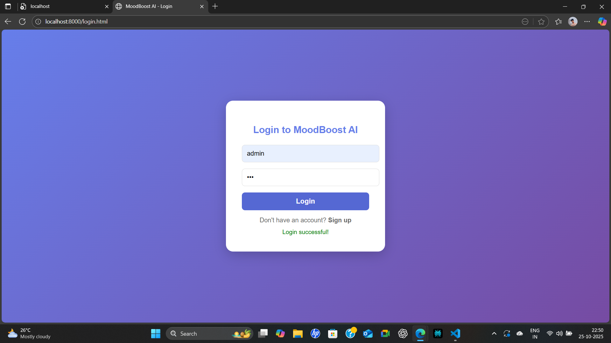
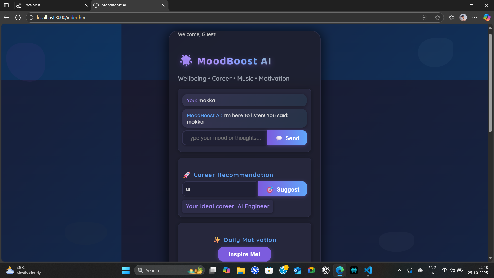

# MoodBoost AI

MoodBoost AI is a comprehensive web application that empowers users with mental wellness, career guidance, motivational content, and personalized support, all wrapped in a beautiful dark-themed interface.

---

## Features

- AI Chatbot for mental wellbeing conversation  
- Career recommendations based on user interests  
- Daily motivational quotes and YouTube videos  
- Emotion to music playlist suggestions  
- User authentication with login/signup and chat history  
- Life & Love Support for real-life setbacks  
- Dark mode UI with fluid animations  

---

## Screenshots

### Login Page  

### Homepage (version 1)  
.png.png)

### Homepage (version 2)  

---

## Installation

1. Clone the repository:  
git clone https://github.com/yourusername/moodboost-ai.git
cd moodboost-ai

text

2. Install dependencies:  
pip install -r requirements.txt

text

3. Start backend server:  
cd backend
python app.py

text

4. Start frontend server:  
cd ../frontend/public
python -m http.server 8000

text

5. Open browser and visit:  
http://localhost:8000/login.html

text

---

## Tech Stack

| Technology     | Role                           |
|----------------|--------------------------------|
| Python, Flask  | Backend API                   |
| SQLite         | Database                      |
| HTML, CSS, JS  | Frontend UI                   |
| Flask-CORS     | Cross-Origin Resource Sharing |
| Flask-Bcrypt   | Password hashing              |

---

## Future Scope

- Integrate GPT-powered chatbot responses  
- Google/LinkedIn OAuth login integration  
- More detailed progress tracking dashboard  
- Expanded emotion-mood music mapping  
- Mobile app version  

---

## Author

Made by Manoj S
portfolio: https://manojmanvy.github.io/manoj_portfolio/

---
